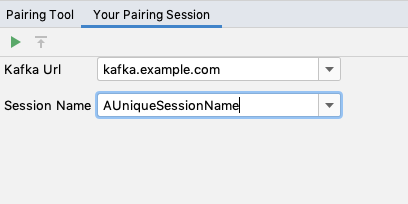

# IntelliJ Pairing Plugin

[](https://travis-ci.org/tyro/pairing-tool)
[](http://www.apache.org/licenses/LICENSE-2.0)

This plugin has been designed to make pairing more natural for developers using different machines.

## Installation

Stable releases are being released all of the time. See [releases](https://github.com/tyro-private/scotty-pairing-tool/releases) for the latest

For un-released code use:
```bash
./install-plugin.sh
```

## Run a kafka image somewhere
```bash
./run-kafka.sh
```

## Connect to a workspace



To connect to a session just navigate to the Pairing Tool panel.
1) Put in a kafka server: <kafka.example.com>
2) Give your session a name: <AUniqueSessionName>
3) Tell your pair to use the same settings

Note: Use a unique session name so that you don't push updates to others who don't want them

## Copyright and Licensing

Copyright 2020 Tyro Payments Limited

Licensed under the Apache License, Version 2.0 (the "License");
you may not use this file except in compliance with the License.
You may obtain a copy of the License at

    http://www.apache.org/licenses/LICENSE-2.0

Unless required by applicable law or agreed to in writing, software
distributed under the License is distributed on an "AS IS" BASIS,
WITHOUT WARRANTIES OR CONDITIONS OF ANY KIND, either express or implied.
See the License for the specific language governing permissions and
limitations under the License.

## Contributing

See [CONTRIBUTING](CONTRIBUTING.md) for details.
